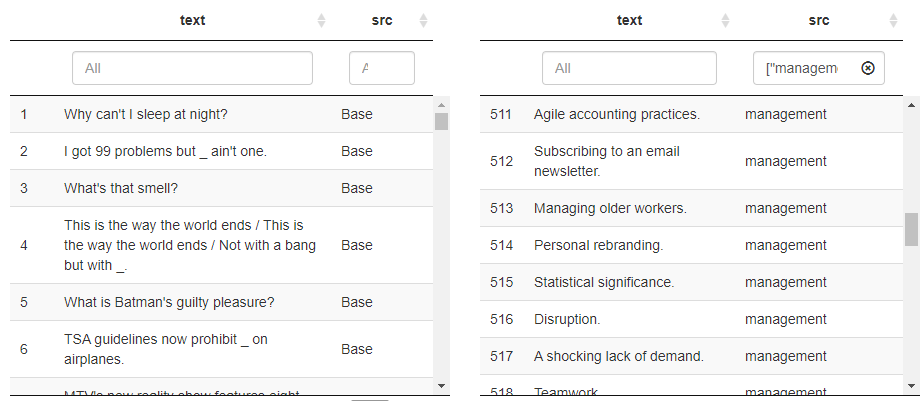

# Cards Against Humanagement 

**Deck-building scripts for Cards Against Humanity-style games on playingcards.io**

See code and interactive version of this page here:

https://derring-do.github.io/cards-against-humanagement/cardsAgainstHumanagement.html

## Background

My team uses board game sessions to break up long days and keep in touch while working remotely. We recently discovered [playingcards.io](http://playingcards.io/docs/overview), which has been great for adapting/customizing our favorites and starting multiplayer sessions quickly and without having to install stuff or make new accounts.

They have a template for CAH called "Remote Insensitivity" that I configured to use some of the base CAH cards plus custom ones related to our team/work/inside jokes.

This repo has scripts and tools for constructing and QAing custom decks to preserve the balance and fluidity of CAH. Specifically:

1. Wrangles the official Cards Against Humanity card text from [Chris Hallberg's awesome repo](https://github.com/crhallberg/json-against-humanity)
2. Benchmarks the black:white ratio and syntactic properties of card text (e.g., plurals, gerunds, number of Pick 2s)
3. Provides a UI to visually inspect how your new cards mesh with the base cards 
4. Generates the CSV format needed for playingcards.io

[Business Insider has a good tutorial](https://www.businessinsider.com/cards-against-humanity-virtually-online-video-chat-how-to-play-2020-3) for configuring a playingcards.io game.

*Screenshot of playingcards.io configuration for Remote Insensitivity/Cards Against Humanity*

## 1. Choose decks from json-against-humanity and add your custom cards

I selected the base deck and 6 expansions from the `r length(jah_dir)` available in the [json-against-humanity repo](https://github.com/crhallberg/json-against-humanity/tree/master/src) as well as my custom deck called "management." 

# 2. Benchmark the component decks and the combined megadeck

The base deck has a 16:84 ratio of black (prompts) to white (responses) cards, while the expansions are closer to 25:75. My "management" deck is close in size to an expansion pack, but has a ratio closer to 50:50  black:white. Combined, the ratio is 24:76 which doesn't feel too disruptive but might feel different in gameplay.

Curiosities:

1. The 2nd expansion has no non-fill-in-the-blank black cards
1. The 6th expansion's black cards are primarily single fill-in-the-blanks as opposed to direct questions, Pick 2s, or Pick Ns

## 3. Censor cards as appropriate for norms among your intended audience

I made some [choices](utils.R) for job security. The regex is shoddy but false positives are better than false negatives in this case.

## 4. Benchmark the censored decks

You lose `r percent(1-bench_all$n[bench_all$deck=="all_sfw"]/bench_all$n[bench_all$deck=="all"])` of the cards from the combined deck after censoring and end up with a lower ratio of white cards.

## 5. See how your new cards mesh with the canonical cards

This is just a way to compare/filter to see how new cards will mesh with the others.

## 6. Output CSVs for playingcards.io upload

Instructions: http://playingcards.io/docs/overview

Column names must match the card template in the UI.
