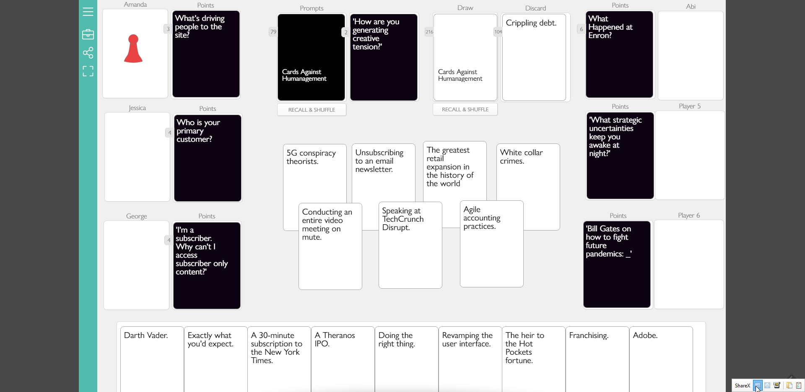

**Deck-building scripts for Cards Against Humanity-style games on playingcards.io**

See interactive version of this page here: LINK

## Background

My team uses board game sessions to break up long days and keep in touch while working remotely. We recently discovered [playingcards.io](http://playingcards.io/docs/overview), which has been great for adapting/customizing our favorites and starting multiplayer sessions quickly and without having to install stuff or make new accounts.

They have a template for CAH called "Remote Insensitivity" that I configured to use some of the base CAH cards plus custom ones related to our team/work/inside jokes.

This repo has scripts and tools for constructing and QAing custom decks to preserve the balance and fluidity of CAH. Specifically:

1. Wrangles the official Cards Against Humanity card text from [Chris Hallberg's awesome repo](https://github.com/crhallberg/json-against-humanity)
2. Benchmarks the black:white ratio and syntactic properties of card text (e.g., plurals, gerunds, number of Pick 2s)
3. Provides a UI to visually inspect how your new cards mesh with the base cards 
4. Generates the CSV format needed for playingcards.io

[Business Insider has a good tutorial](https://www.businessinsider.com/cards-against-humanity-virtually-online-video-chat-how-to-play-2020-3) for configuring a playingcards.io game.

*Screenshot of playingcards.io configuration for Remote Insensitivity/Cards Against Humanity*




```{r}
knitr::opts_chunk$set(echo=TRUE, warning=FALSE, message=FALSE)
opts_dt <- list(scrollX=TRUE)

suppressPackageStartupMessages({
  library(dplyr)
  library(stringr)
  library(scales)
  library(DT)
  library(fastDummies)
})

source("utils.R")

jah_dir    <- dir("json-against-humanity/src", full.names = TRUE)
jah_picks  <- grep("Base\\>|CAHe", jah_dir, value=TRUE)
custom_dir <- "custom/management"

# named list makes life easier later
decks <- c(lapply(jah_picks, import_deck) %>% setNames(basename(jah_picks)), 
           list(management=import_deck(custom_dir, black_file="prompts.txt", white_file="responses.txt"))
           )

megadeck <- bind_rows(decks)

decks <- c(decks, list(all=megadeck))

# names(decks)

# Benchmarks
bench <- lapply(decks, benchmark_deck, "benchmark") %>% bind_rows %>% {.$deck <- paste0(names(decks), ""); .}
bench_sfw <- lapply(decks, benchmark_deck, "benchmark", censor_regex=nsfw) %>% bind_rows %>% {.$deck <- paste0(names(decks), "_sfw"); .}
bench_all <- bind_rows(bench, bench_sfw)

# these are standalone but best mech to combine/mix and match?

bench_dt <- bench %>% datatable(options=opts_dt,
                    caption = htmltools::tags$caption(
      style = 'caption-side: top; text-align: left; line-height:3.5rem; font-size:2rem',
      htmltools::strong('Benchmark stats for select CAH decks/expansions, custom cards, and the cumulative megadeck')
    )
)
```
## 1. Choose decks from json-against-humanity and add your custom cards

I selected the base deck and 6 expansions from the `r length(jah_dir)` available in the [json-against-humanity repo](https://github.com/crhallberg/json-against-humanity/tree/master/src) as well as my custom deck called "management." 

```{r}
decks[["Base"]][c(1:3, 501:503), ] %>% 
  datatable(options=opts_dt,
                caption = htmltools::tags$caption(
      style = 'caption-side: top; text-align: left; line-height:3.5rem; font-size:2rem',
      htmltools::strong('Example rows from CAH base deck')
    )
)
```

# 2. Benchmark the component decks and the combined megadeck

The base deck has a 16:84 ratio of black (prompts) to white (responses) cards, while the expansions are closer to 25:75. My "management" deck is close in size to an expansion pack, but has a ratio closer to 50:50  black:white. Combined, the ratio is 24:76 which doesn't feel too disruptive but might feel different in gameplay.

Curiosities:

1. The 2nd expansion has no non-fill-in-the-blank black cards
1. The 6th expansion's black cards are primarily single fill-in-the-blanks as opposed to direct questions, Pick 2s, or Pick Ns


`r bench_dt`

## 3. Censor cards as appropriate for norms among your intended audience

I made some [choices](utils.R) for job security. The regex is shoddy but false positives are better than false negatives in this case.

```{r censored}
nsfw_entries <- lapply(decks, benchmark_deck, "df", censor_regex=nsfw, filter_df=FALSE) %>% bind_rows %>% 
  filter(remove == TRUE) %>% 
  select(text, Label, src)

nsfw_entries %>% 
  datatable(
    options=list(opts_dt, pageLength=nrow(nsfw_entries), scrollY="350px"),
    caption = htmltools::tags$caption(
      style = 'caption-side: top; text-align: left; line-height:3.5rem; font-size:2rem',
      htmltools::strong('NSFW cards to remove')
    )
  )
```

## 4. Benchmark the censored decks

You lose `r percent(1-bench_all$n[bench_all$deck=="all_sfw"]/bench_all$n[bench_all$deck=="all"])` of the cards from the combined deck after censoring and end up with a lower ratio of white cards.

```{r}
bench_all %>% 
  datatable(options =
              list(scrollX=TRUE, scrollY="300px", pageLength=nrow(bench_all)),
            caption = htmltools::tags$caption(
              style = 'caption-side: top; text-align: left; line-height:3.5rem; font-size:2rem',
              htmltools::strong('Default cards and SFW cards')
            )
  )
```

## 5. See how your new cards mesh with the canonical cards

This is just a way to compare/filter to see how new cards will mesh with the others.

<div class = "row">
<div class = "col-md-6">
```{r black,  warning = FALSE, echo = FALSE, dev=c('svg')}
# constrain height and make inf scroll
decks_sfw <- benchmark_deck(megadeck, "df", censor_regex=nsfw) %>% mutate(src=as.factor(basename(src)))
decks_sfw %>% filter(Label=="Black") %>% select(text, src) %>% datatable(filter="top", options=list(opts_dt, scrollY="300px", pageLength=nrow(.)))
```
</div>
<div class = "col-md-6">
```{r white, warning = FALSE, echo=FALSE, dev=c('svg')}
decks_sfw %>% filter(Label=="White") %>% select(text, src) %>% datatable(filter="top", options=list(opts_dt, scrollY="300px", pageLength=nrow(.)))

# custom_whites <- decks_sfw %>% 
#   filter(src == "custom/management" & Label == "White" | Label == "Black")
# 
# datatable(sample_deck(custom_whites), options=opts_dt)

```
</div>
</div>

## 6. Output CSVs for playingcards.io upload

Instructions: http://playingcards.io/docs/overview

Column names must match the card template in the UI.

```{r output}
decks_sfw %>% filter(Label=="Black") %>% select(Label, prompt) %>% write.csv(., "playingcardsio_prompts.csv", row.names=FALSE)

decks_sfw %>% filter(Label=="White") %>% select(Label, prompt) %>% write.csv(., "playingcardsio_responses.csv", row.names=FALSE)
```
